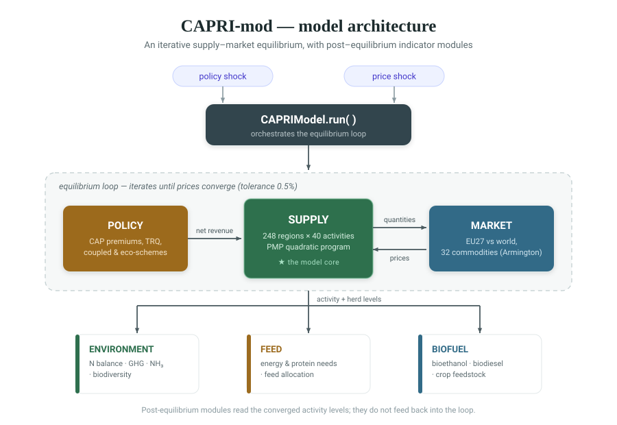

# CAPRI-mod

**An independent, validated Python reimplementation of the economic logic of the
CAPRI model** (Common Agricultural Policy Regionalised Impact).

CAPRI-mod reproduces CAPRI's regional agricultural supply, market, policy,
environmental, feed and biofuel behaviour across **248 NUTS-2 regions (EU27 +
Norway)**, **40 activities** (29 crops, 11 livestock) and **32 market
commodities** — in a few thousand lines of transparent, tested Python. Every
input is traceable to a source, and every module's output has been checked
against CAPRI's own data or scenario results.

It is an independent implementation of CAPRI's *methods and calibration data*,
not a copy of its code.

---

## Table of contents

1. [Overview](#1-overview)
2. [Why CAPRI-mod](#2-why-capri-mod-strengths)
3. [Installation & quick start](#3-installation--quick-start)
4. [The data layer](#4-the-data-layer)
5. [Model architecture](#5-model-architecture)
6. [Baseline & scenarios](#6-baseline--scenarios)
7. [Running the model](#7-running-the-model)
8. [Sensitivity & uncertainty analysis](#8-sensitivity--uncertainty-analysis)
9. [Validation](#9-validation)
10. [Differences from CAPRI, and why they are deliberate](#10-differences-from-capri-and-why-they-are-deliberate)
11. [Known limitations](#11-known-limitations)
12. [Provenance & reproducibility](#12-provenance--reproducibility)
13. [Contributors](#13-contributors)
14. [Relationship to CAPRI](#14-relationship-to-capri)

---

## 1. Overview

### What the model does

CAPRI-mod is a **comparative-static** partial-equilibrium model of EU
agriculture. Given a policy or price shock, it computes how the base-year
agricultural economy re-settles into a new equilibrium: how farmers reallocate
land and herds, how markets clear, and what the environmental consequences are.

**It answers:** *"What does this policy, on its own, do to the agricultural
sector?"* — the isolated effect of a policy change.

### The base year is a parameter, not a fixed assumption

Inputs are organised under `capri_data/<base_year>/` and selected via
`load_all_data(base_year=...)`, so the model can be re-based to any year for
which CAPRI data has been extracted. The currently populated and validated base
year is **2017**. Re-basing to a newer year requires extracting that year's
CAPRI GDX data into a new `capri_data/<year>/` folder. Throughout this document,
"2017" refers to the current base year, not a structural limitation.

### At a glance

| | |
|---|---|
| Regions | 248 NUTS-2 (EU27 + Norway) |
| Activities | 40 (29 crops, 11 livestock) |
| Market commodities | 32 |
| Base year | 2017 (parameterised) |
| Supply method | Positive Mathematical Programming (PMP) |
| Market method | Armington, EU27 vs rest-of-world, tâtonnement |
| Data validator | 12 pass, 0 warn, 0 fail |
| Convergence | 247 / 248 regions |
| Test suite | 18 tests |

---

## 2. Why CAPRI-mod (strengths)

This section states plainly what CAPRI-mod does *well* — the parts that were
engineered deliberately and are its reasons to exist.

### 2.1 Every input is real and traceable to its source

The data layer is the model's strongest asset. Inputs are extracted **directly
from CAPRI's GDX files**, never from Excel exports (which earlier introduced
homoglyph corruption, dropped regional detail, and silent synthetic fallbacks).

- **Provenance is tracked per column, not per file.** A file-level "real" label
  once concealed 16 synthetic columns inside a file marked real; per-column
  tracking makes that impossible.
- **99.4% of live cells are real CAPRI data** — an honest per-cell count, not a
  flattering area-weighted figure. Every non-real cell is explicitly labelled.
- **A declarative schema** (`INPUT_SCHEMA.json`) is the single source of truth:
  22 declared inputs, each with its source, unit, dimension, consuming modules,
  and known gaps. It is built to survive a future swap of CAPRI inputs for
  external sources (Eurostat, FADN) as a field edit rather than a rewrite.

### 2.2 Validation against CAPRI's own numbers — not just "it runs"

Every one of the six modules has been checked against CAPRI's actual data or
scenario output, with the validation *method* stated for each (see
[§8](#8-validation)). This is the core credibility claim: the outputs are not
merely plausible, they have been compared to ground truth.

### 2.3 Scenario validation reproduces CAPRI's behaviour

The supply, environment and market modules have been validated at the
**scenario** level — the same Green Deal shock run through both models produces
the same directional response (livestock extensification, rising livestock
prices, the correct commodity ranking). This is the strongest form of validation
and the hardest to fake.

### 2.4 Self-protecting data pipeline

The failure mode behind several historical bugs — an input silently emptying and
being replaced by a fallback — is now caught automatically. A **per-input
coverage gate** in the test suite fails loudly if any declared input drops
below its expected coverage, so a silent-drop regression cannot pass unnoticed.

### 2.5 Transparency and speed

The entire economic core is a few thousand lines of readable Python. A full
248-region base run completes in minutes on a laptop, with no GAMS licence, no
proprietary solver, and every intermediate quantity inspectable.

---

## 3. Installation & quick start

Install the dependencies and run the test suite from the command line:

```shell
pip install numpy pandas scipy
python tools/run_tests.py
```

Then, in Python — validate the data layer and run a minimal base scenario:

```python
from capri_mod.data.validate_data import validate_data
from capri_mod.model import CAPRIModel

# validate the data layer
print(validate_data("capri_data").summary())

# a minimal base run
model = CAPRIModel(data_dir="capri_data")
results = model.run(scenario="BASELINE", regions=["DE11", "FR61"])
print(results["metadata"])
```

---

## 4. The data layer

### 4.1 Directory structure


### 4.2 The 22 declared inputs

Every input the model consumes is declared in `INPUT_SCHEMA.json` with its
concept, unit, and consuming modules:

| Input | Concept | Unit | Modules |
|---|---|---|---|
| yields | output per unit of activity | kg/ha, per head | supply, market, feed |
| base_areas | activity level | 1000 ha / head | supply |
| variable_costs | intermediate input cost | EUR/ha | supply |
| producer_prices | farm-gate price | EUR/t | supply, market |
| cap_payments | CAP premium per activity | EUR/ha, /head | supply, policy |
| land_availability | land endowment by category | 1000 ha | supply |
| animal_numbers | herd size | 1000 head | supply, env, feed |
| nutrient_coefs | fertiliser application | kg/ha | environment, supply |
| manure_nutrients | manure nutrient excretion | kg/head/yr | environment |
| supply_elasticities | own-price supply elasticity | — | supply |
| market_supply_elasticities | market-level supply elasticity | — | market |
| pmp_diagonal_terms | PMP own quadratic term | EUR/ha² | supply |
| pmp_crossgroup_terms | PMP cross-group term | EUR/ha² | supply |
| world_prices | world market price | EUR/t | market |
| armington_params | Armington substitution elasticities | — | market |
| trade_flows | bilateral trade / import shares | 1000 t | market |
| feed_requirements | energy/protein/DM/days per animal | mixed | feed |
| feed_availability | feed supply by item | 1000 t DM | feed |
| crop_nutrient_export | nutrient removal per ton yield | kg/t | environment |
| climate_zones | IPCC climate zone shares | share | environment |
| manure_ch4_ef | methane emission factor | kg CH₄/head/yr | environment |
| eu_mfn_tariffs | applied MFN tariff | % or EUR/t | market |

### 4.3 How to inspect and verify the data

Check per-cell provenance coverage against the schema from the command line:

```shell
python tools/verify_schema.py
```

Run the full data validator (margins, coverage, consistency) in Python:

```python
from capri_mod.data.validate_data import validate_data

print(validate_data("capri_data").summary())
```

### 4.4 Re-basing or swapping data sources

Because the schema declares each input's source and the loader resolves files
under `capri_data/<base_year>/<category>/`, replacing a source is a localised
change: extract the new data into the correct folder with the same column
structure, update the schema's `source` field, and re-run the validator. The
coverage gate will confirm nothing silently emptied.

---

## 5. Model architecture

CAPRI-mod is six focused, independently testable modules coordinated by
`CAPRIModel`, which runs the iterative supply↔market loop.

### 5.1 How the pieces fit together



The **outer loop** is the heart of the model: policy sets net revenues → supply
chooses activities → market clears and returns prices → prices re-enter supply →
repeat until prices stop moving (default tolerance 0.5%). Environment, feed and
biofuel are **post-equilibrium** modules: they read the converged activity levels
and compute their indicators.

### 5.2 The modules

| Module | Lines | Core method | Economic engine |
|---|---:|---|---|
| `supply/` | 1,270 | PMP quadratic program per region | Positive Mathematical Programming |
| `market/` | 780 | Armington + tâtonnement clearing | Armington trade, CES demand |
| `policy/` | 570 | CAP payment & tariff computation | direct payments, TRQ, eco-schemes |
| `environmental/` | 590 | indicators from activity levels | IPCC / nutrient-balance accounting |
| `feed/` | 780 | requirement + allocation LP | IPCC 2006 energy, feed optimisation |
| `biofuel/` | 150 | mandate-driven demand | blending-mandate feedstock demand |

**Supply — Positive Mathematical Programming.** The core of the model. Each of
the 248 regions solves its own constrained non-linear program over 40 activities.
A quadratic cost term is calibrated (`PMPCalibrator`) so the model **exactly
reproduces observed base-year activity levels** — then, under a shock, responds
along CAPRI's own supply elasticities. Constraints capture land by type, feed
availability, and grassland. Key classes: `RegionalSupplyModel` (one region's
program), `PMPCalibrator` (the calibration), `SupplyModule` (orchestration).

**Market — Armington equilibrium.** Clears the EU27 as a single bloc against the
rest of the world. Import demand uses an Armington (imperfect-substitutes)
specification; the market finds clearing world prices by tâtonnement (excess
demand drives price adjustment). Demand is calibrated once at the base and frozen,
so a scenario supply shock produces a genuine price response rather than being
cancelled by re-calibration. Key classes: `ArmingtonDemand`, `MarketModule`.

**Policy — the CAP instruments.** Turns policy levers into the net revenues the
supply module optimises against. Implements Pillar-I basic income support and
coupled payments, eco-schemes, Pillar-II rates, and the trade instruments
(applied tariffs and tariff-rate quotas with fill-dependent rents). A
`PolicyScenario` object is the single, typed description of a policy experiment.
Key classes: `DirectPaymentsEngine`, `TRQHandler`, `InterventionSystem`,
`PolicyScenario`.

**Environment — the indicator suite.** Reads converged activity and herd levels
and computes nutrient balances (N surplus), greenhouse-gas emissions (enteric
methane, manure, soils), ammonia, and biodiversity indicators — per region. Built
on CAPRI's own coefficients (`MANN` manure nitrogen, IPCC emission factors). Key
class: `EnvironmentalModule` returning structured `EnvironmentalIndicators`.

**Feed — requirements and allocation.** Computes each animal's energy, protein
and dry-matter requirements — ruminants via IPCC 2006 Eq. 10.6, monogastrics
calibrated to CAPRI targets — then allocates available feed to meet them,
returning feed use and the manure nutrients that flow into the environment
module. Key class: `FeedModule`, with `AnimalRequirements` per animal.

**Biofuel — mandate-driven demand.** Translates a blending mandate into
bioethanol and biodiesel volumes and the crop feedstock they require, which feeds
back into commodity demand. Small and self-contained. Key class: `BiofuelModule`.

### 5.3 Orchestration

`CAPRIModel` (in `model.py`) owns the loop: it applies the policy scenario, runs
supply, bridges supply quantities into the market, clears the market, feeds prices
back, and iterates to convergence — then runs the post-equilibrium modules and
returns a single results dictionary (see [§7](#7-running-the-model)).

### 5.4 Where CAPRI-mod is identical to CAPRI

CAPRI-mod is an independent *implementation*, but it is not an approximation: in
its economic structure and methods it follows CAPRI faithfully. The following are
the **same method and structure** as CAPRI, not simplifications of it:

- **PMP supply.** The same Positive Mathematical Programming approach — a
  quadratic cost term calibrated to reproduce observed activity levels exactly —
  over the same NUTS-2 region × activity structure.
- **Supply elasticities.** CAPRI's own national `p_netPutElas` estimates,
  broadcast to regions exactly as CAPRI does in its `calibrate_supply` step.
- **Armington market.** The same imperfect-substitutes trade specification for
  EU-vs-world price formation.
- **CAP payments.** CAPRI's actual `PRME` premium values, in the same
  per-activity payment structure.
- **Feed energy.** CAPRI's ruminant energy formula — IPCC 2006 Eq. 10.6 from
  `req_or_man_fnc.gms` — ported directly.
- **Environmental coefficients.** CAPRI's `MANN` manure-nitrogen coefficients
  and IPCC emission factors.
- **Regional resolution.** 248 of CAPRI's 288 NUTS-2 units — the full EU27 +
  Norway set, at CAPRI's own granularity.

The deliberate *differences* — comparative-static scope, EU27 as a single bloc,
and a few calibrated-to-target parameters — are set out in
[§10](#10-differences-from-capri-and-why-they-are-deliberate). Everything else is
CAPRI's method, reimplemented and validated against CAPRI's own output.

---

## 6. Baseline & scenarios

### 6.1 What "baseline" means here

The **baseline** is the calibrated base-year equilibrium — the model reproducing
2017 exactly. Because CAPRI-mod is comparative-static, the baseline is a
*fixed reference point*, not a forward trajectory. Every scenario is measured as
a deviation from this baseline.

> **Note on projections.** CAPRI's published scenarios (e.g. Green Deal 2030)
> are *dynamic projections* that evolve the economy forward ~13 years and then
> apply policy. CAPRI-mod deliberately does not do this — see
> [§10.1](#101-comparative-static-not-a-dynamic-projection). A dynamic-projection
> mode would require constructing and defending a baseline trajectory, a
> substantial separate undertaking.

### 6.2 Built-in scenarios

`CAPRIModel.list_scenarios()` returns the packaged policy scenarios:

| Scenario | Description |
|---|---|
| `BASELINE` | calibrated base-year reference |
| `CAP_2023_2027` | current CAP programming period |
| `CAP_REFORM_2030` | illustrative post-2027 CAP reform |
| `FARM_TO_FORK` | Green Deal Farm-to-Fork input reductions |
| `FLAT_RATE_BPS` | flat-rate basic payment |
| `SET_ASIDE_10PCT` | 10% set-aside |
| `N_LIMITS_TIGHTER` | tighter nitrate limits |
| `CARBON_TAX_50`, `CARBON_TAX_100` | carbon price on emissions |
| `WTO_LIB`, `WTO_FALCONER` | trade liberalisation |
| `UKRAINE_SHOCK` | trade/supply disruption |

### 6.3 Custom scenarios

A scenario is a set of shocks: CAP premium changes (per activity, `CROPS`,
`LIVESTOCK`, or `ALL`), world-price shocks, or nitrate limits. Build a
`PolicyScenario` object or pass shocks directly to `run()` (see
[§7](#7-running-the-model)).

---

## 7. Running the model

### 7.1 Base run

```python
from capri_mod.model import CAPRIModel

model = CAPRIModel(data_dir="capri_data", base_year="2017")
results = model.run(scenario="BASELINE")

# results is a dict: supply, market, environmental, policy_summary, metadata
print(results["market"].world_prices.head())
```

### 7.2 A built-in policy scenario

```python
results = model.run(scenario="CAP_REFORM_2030", run_environmental=True)
```

### 7.3 A custom shock

```python
# +100 EUR/ha on all crop premiums, and a world wheat price rise
results = model.run(
    scenario="BASELINE",
    world_price_shock={"SWHE": 0.10},          # +10% world wheat price
)
```

### 7.4 Comparing a scenario to baseline

```python
base = model.run(scenario="BASELINE")
scen = model.run(scenario="FARM_TO_FORK")
delta = model.compare(base, scen)              # activity & price changes
```

### 7.5 Key `run()` parameters

| Parameter | Default | Meaning |
|---|---|---|
| `scenario` | `"BASELINE"` | named scenario (see `list_scenarios()`) |
| `world_price_shock` | `None` | `{commodity: relative_change}` |
| `custom_scenario` | `None` | a `PolicyScenario` object |
| `run_environmental` | `True` | also compute environmental indicators |
| `run_feed` / `run_biofuel` | `False` | enable feed / biofuel modules |
| `regions` | all | restrict to a region subset |
| `outer_tolerance` | `0.005` | supply↔market convergence tolerance |

---

## 8. Sensitivity & uncertainty analysis

CAPRI-mod ships a results-persistence layer (`capri_mod.io_results`) and a
scenario-lever interface designed for systematic sensitivity and uncertainty
analysis. **A full worked reference — including SALib/Sobol and Morris examples —
is in [`SENSITIVITY_ANALYSIS.md`](SENSITIVITY_ANALYSIS.md).** The essentials:

### 8.1 What you can vary

- **Policy / scenario levers (~15, low-dimensional, interpretable):** the fields
  of `PolicyScenario` (basic income support, coupled support, eco-scheme budget,
  Pillar-II rates, tariffs, TRQ volumes, nitrate limit, set-aside, quotas) plus
  `run()` arguments (`biofuel_mandate`, `world_price_shock`). This is the
  recommended starting point for most studies.
- **Data-group scaling:** whole input groups (yields, costs, elasticities)
  scaled together — e.g. "yields ±10%". Varying all ~177,000 individual data
  points is possible but rarely sensible; choose interpretable levers instead.

### 8.2 What you get back

`flatten_outputs()` reduces each run to ~40 scalar response indicators (world
price and production per commodity, biofuel output, total gross margin,
convergence flags). Full regional detail (activities, prices, trade, GHG,
nutrient balances) is available per run.

### 8.3 The workflow

```python
from capri_mod.model import CAPRIModel
from capri_mod.io_results import Experiment

m = CAPRIModel(data_dir="capri_data", verbose=False)
regions = list(m.data["areas"].index[:30])     # ≥30 for a representative base

exp = Experiment("my_study", model=m)
for i in range(200):
    r = m.run(scenario="BASELINE", regions=regions,
              run_biofuel=True, biofuel_mandate=...,
              world_price_shock={"SWHE": ...})
    exp.save_run(r, run_id=f"run_{i:04d}", inputs={...})
table = exp.finalise()   # writes outputs/my_study/batch_summary.csv
```

`batch_summary.csv` places the sampled inputs (`in_*` columns) alongside every
output indicator — the single file any sensitivity library consumes. Runs are
independent, so the batch loop parallelises trivially. See the reference doc for
the Sobol/Morris integration and post-hoc analysis without re-running.

---

## 9. Validation

The central claim is not that the model runs, but that its outputs have been
**checked against CAPRI's actual data and scenario results**, module by module.

| Module | Status | How validated |
|---|---|---|
| **Supply — crops** | Validated | Realized own-price elasticities match CAPRI's PELA targets within ~10% |
| **Supply — livestock** | Validated (direction) | Green Deal scenario: reproduces CAPRI's cattle-extensification signal |
| **Policy / CAP** | Validated | Premiums match CAPRI `PRME` exactly; payment mechanism responds by the economically-correct amount |
| **Environment** | Validated | N excretion matches CAPRI `MANN` within ~12%; GHG responds correctly to scenario activity changes |
| **Feed** | Validated (ruminants) | Energy & dry matter match CAPRI within ~10% via IPCC 2006 Eq. 10.6; monogastrics calibrated to CAPRI targets |
| **Market** | Validated | Base prices match CAPRI `PMRK`; scenario supply shocks move prices in CAPRI's direction |
| **Biofuel** | Validated (external) | Output within 10% of observed EU statistics; mandate mechanism linear-consistent |

### 9.1 Validation methods

- **Scenario (strongest):** run the same shock through both models and compare
  responses. Used for supply-livestock, environment (GHG), and market.
- **Coefficient:** compare our computed value against CAPRI's computed value for
  the same quantity. Used for crops, feed, environment (N), CAP mechanism.
- **Input reproduction:** confirm loaded data matches CAPRI's GDX. Used for CAP
  premiums and throughout the data layer.

### 9.2 Worked example: the Green Deal scenario

The strongest validation is end-to-end: run the *same* policy scenario through
both models and compare the responses. CAPRI-mod was tested against CAPRI's own
Green Deal run — the supply-side livestock response and the market-side price
response, both compared to CAPRI's actual scenario GDX output.

**Supply side — livestock extensification.** Under the Green Deal cattle-margin
lift, every cattle activity moves in the correct direction, matching CAPRI:

| Activity | CAPRI-mod | CAPRI Green Deal | Direction |
|---|---:|---:|:---:|
| Dairy cows (DCOW) | +1.1% | +6% | ✓ |
| Suckler cows (BCOW) | +1.5% | +13% | ✓ |
| Heifers (HFRS) | +1.0% | +9–18% | ✓ |
| Calves (CALV) | +1.9% | ~+5% | ✓ |

**Market side — prices.** Under the same scenario's livestock supply
contraction, CAPRI-mod's world prices rise, livestock most — the same
"extensification tightens supply, prices rise" signal CAPRI produces (CAPRI:
milk +41%, pork +36%, beef +25%).

**On magnitude.** CAPRI-mod's responses are smaller than CAPRI's 2030 figures,
and this is expected, not an error: CAPRI-mod reports the *isolated policy
effect* on the base-year economy, while CAPRI's Green Deal is a 2030 projection
that compounds the policy with ~13 years of baseline growth and endogenous
technology. The correct comparison is **direction and relative ranking**, and on
that basis CAPRI-mod reproduces CAPRI's behaviour: livestock expands, its prices
rise most, crops barely move (see [§10.1](#101-comparative-static-not-a-dynamic-projection)).

Reaching this agreement required finding and fixing real bugs along the way —
the regional livestock module initially produced no response at all — each of
which is recorded in `DATA_SOURCING_REGISTRY.json`. The result is a model that,
module by module, moves the way CAPRI moves.

---

## 10. Differences from CAPRI, and why they are deliberate

Each difference is a considered design choice, not a shortfall.

### 10.1 Comparative-static, not a dynamic projection

**The difference:** CAPRI's published scenarios evolve the whole economy forward
from the base year — compounding baseline yield growth, demand shifts and
endogenous technology over ~13 years — *and then* apply policy. CAPRI-mod
holds the world at the base year and applies only the policy shock.

**Why deliberate:** it **isolates the policy effect**. A CAPRI 2030 number blends
"what this policy does" with "what 13 years of everything-else does"; ours
reports the first alone — the cleaner answer to *"what does this policy do?"* It
also keeps every result traceable to validated base-year data rather than resting
on baseline assumptions about a future that cannot be validated.

**Consequence:** our scenario *magnitudes* are smaller than CAPRI's projection
outputs. **The fair comparison is direction and relative pattern, not absolute
level** — and on direction, CAPRI-mod matches CAPRI.

**A validated core, and a milestone toward projection.** A recursive-dynamic
projection is not a different model that would replace this one — it is a *time
loop wrapped around the same economic core*, solving the comparative-static
equilibrium period by period and carrying state forward. The supply, market,
policy, environmental and feed modules validated here are precisely the
per-period engine such a projection would run forward. This project therefore
establishes and validates the hardest-to-trust component first: that each
single-period solve reproduces CAPRI's behaviour. Extending CAPRI-mod to a
projection system would principally require (a) the recursive-dynamic loop —
bounded, mechanical engineering — and (b) constructing and defending a *baseline
trajectory* (yield growth, demand shifts, technology, world prices), which is
the substantial, open-ended part and shifts the model's epistemic basis from
observed data toward forecast assumptions. **CAPRI-mod is best understood as a
validated comparative-static model and a deliberate first milestone toward a
future recursive-dynamic projection capability** — the load-bearing, empirically
checked foundation that a projection layer would build on.

### 10.2 Toward a recursive-dynamic projection

A projection version would be a **time loop around the validated core**: the same
supply, market and policy modules solve period by period (2017 → 2020 → 2025 →
…), with herd sizes, perennial-crop areas and land allocation carried forward as
each period's starting point. That loop is bounded engineering. The genuinely
hard part is the **baseline trajectory** — the reference path the economy would
follow with no new policy (yield growth, demand shifts, world prices) — and it
cannot be validated the way everything else here has been, because the future has
not happened. CAPRI-mod would manage it by principle, not by guesswork:

- **Adopt a recognised external baseline**, not a home-made one — the EU
  Agricultural Outlook and OECD-FAO *Aglink-Cosimo* projections (the same sources
  CAPRI itself uses). This makes the trajectory an openly-cited authority's
  assumptions rather than the model's own forecast.
- **Always separate baseline drift from the policy increment** in results, so a
  reader can see how much of any future figure is "the world changing anyway"
  versus the policy — preserving the clean, validated policy-effect that is the
  model's strength.
- **Treat the baseline as a versioned, swappable input** in the data schema, with
  its vintage and provenance recorded like any other source.
- **Sensitivity-analyse the baseline itself.** A projection is not defended by
  claiming the trajectory is correct, but by showing which conclusions are robust
  across a range of plausible baselines and which are not — turning unavoidable
  forecast uncertainty into disclosed analysis (the sensitivity machinery in
  [§8](#8-sensitivity--uncertainty-analysis) is built for exactly this).

This is future work, not a current capability — but the load-bearing component,
a per-period solve validated against CAPRI, is already in place.

### 10.3 EU27 as a single market bloc

Treats the EU27 as one Armington bloc trading against the rest of the world,
rather than resolving intra-EU bilateral trade. Sufficient for EU-vs-world price
formation; keeps the market side transparent. Bilateral detail is in the
extracted data and can be added if needed.

### 10.4 248 regions, EU27 + Norway

CAPRI's installation defines 288 NUTS-2 units; CAPRI-mod covers 248. The 40
not covered are non-EU (Turkey, Western Balkans), out of scope by design. Within
EU27 + Norway the granularity matches.

### 10.5 A few parameters calibrated-to-target

Monogastric feed requirements and a small number of specialty world prices are
calibrated to match CAPRI's reported values rather than derived from CAPRI's
formula — because their reported units could not be reconciled without risk of a
compensating error. These cells are explicitly labelled *calibrated-to-target*.

---

## 11. Known limitations

Stated plainly, because a defensible model names its limits:

- **Scenario magnitudes are policy-increment, not 2030-projection** (§10.1).
  Compare directions, not levels, against CAPRI's published scenarios.
- **Monogastric feed energy and a few specialty world prices are
  calibrated-to-target**, not derived.
- **Biofuel and parts of the market module are validated against external data
  or documented behaviour**, not against a CAPRI scenario run.
- **One region (Hamburg, DE60) does not converge** — a genuine city-state edge
  case (~47k ha), not a systematic failure.
- **The model is comparative-static** and cannot answer "what will 2030 look
  like." A projection mode would require constructing and defending a baseline
  trajectory.

---

## 12. Provenance & reproducibility

- `capri_data/INPUT_SCHEMA.json` — declarative source of truth for every input.
- `capri_data/DATA_SOURCING_REGISTRY.json` — per-dataset provenance, including
  every bug found and fixed during validation.
- `capri_data/validation/` — validation artifacts: the Green Deal comparison
  (`greendeal_2030/`) and world-price checks against CAPRI `PMRK`.
- `capri_data_snapshot/` — a hashed snapshot of the data layer for verifiable
  restore.
- `tools/verify_schema.py`, `tools/run_tests.py` — coverage and test gates.

---

## 13. Contributors

- **Gabriele Ghirimoldi** — IT Systems integration and workflow expert, JRC
  Directorate S, Unit 3 CC-MOD. Project lead: data extraction and sourcing,
  validation against the CAPRI star-3.0 installation, and direction of the
  model's design and scope.

- **Claude Opus 4.8 (Anthropic)** — Claude is a large language model used here,
  under direction, for implementation, debugging, numerical validation against
  CAPRI output, and documentation.

---

## 14. Relationship to CAPRI

CAPRI is developed by the CAPRI Network (capri-model.org). CAPRI-mod is an
independent reimplementation of its economic methods for research and policy
analysis, calibrated against a CAPRI star-3.0 installation. It reuses CAPRI's
*methods and calibration data*, not its code. Any errors in this reimplementation
are its own and should not be attributed to CAPRI.
